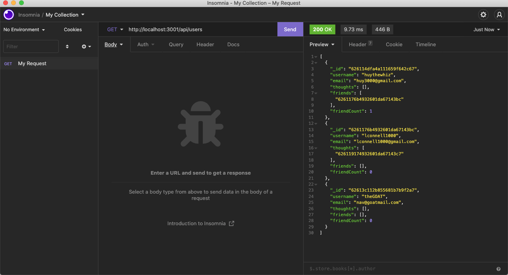
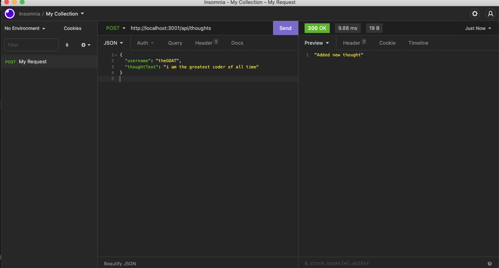
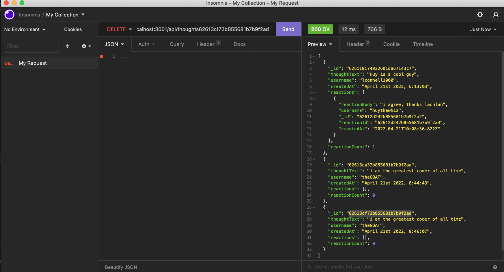
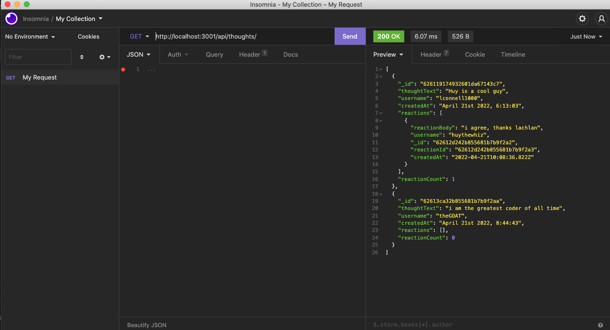
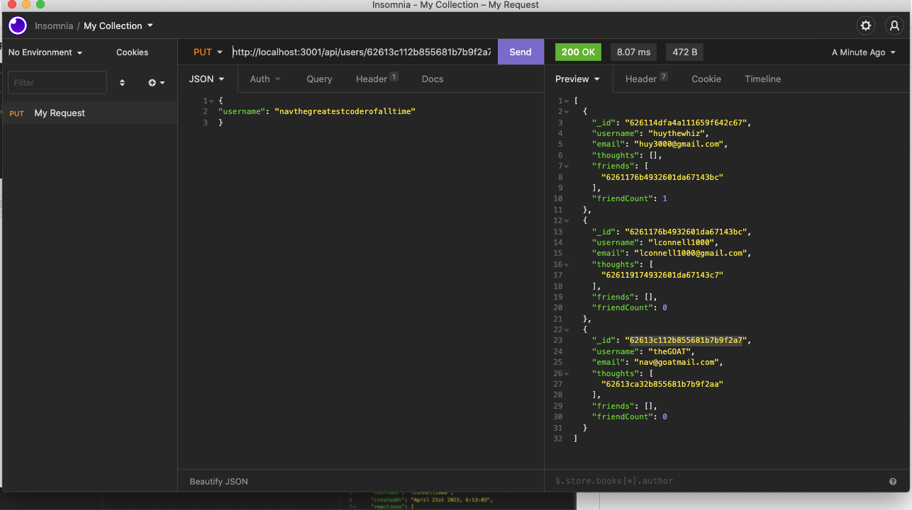
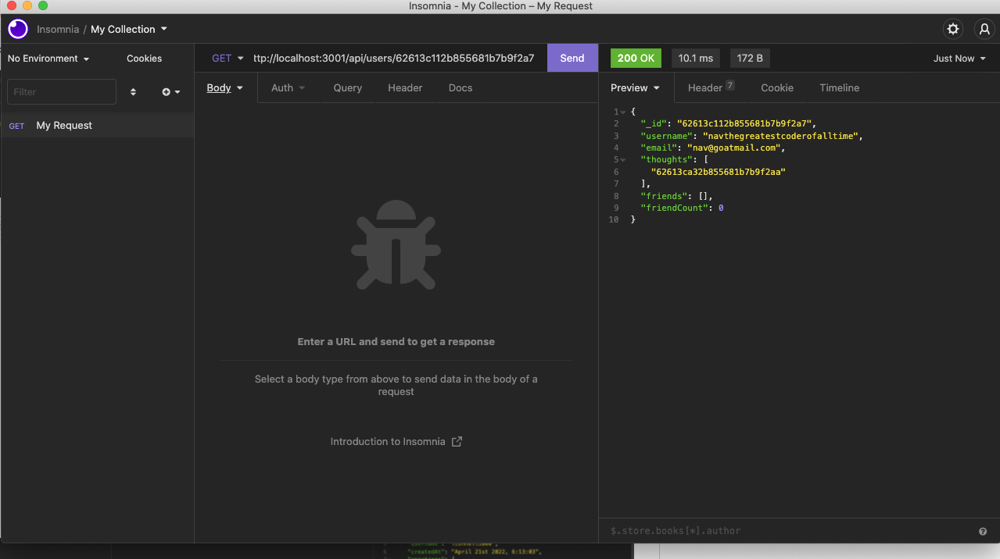

# 18 NoSQL: Social Network API

## The Assignment

MongoDB is a popular choice for many social networks due to its speed with large amounts of data and flexibility with unstructured data. Over the last part of this course, we'll be using several of the technologies that social networking platforms use in their full-stack applications. Because the foundation of these applications is data, it’s important that we understand how to build and structure the API first.

No seed data is provided, so we had to create our own data using insomnia.

Because this application won’t be deployed, a link to a walk through video is shown further below.

## User Story

```md
AS A social media startup
I WANT an API for my social network that uses a NoSQL database
SO THAT my website can handle large amounts of unstructured data
```

## Acceptance Criteria

```md
GIVEN a social network API
WHEN I enter the command to invoke the application
THEN my server is started and the Mongoose models are synced to the MongoDB database
WHEN I open API GET routes in Insomnia for users and thoughts
THEN the data for each of these routes is displayed in a formatted JSON
WHEN I test API POST, PUT, and DELETE routes in Insomnia
THEN I am able to successfully create, update, and delete users and thoughts in my database
WHEN I test API POST and DELETE routes in Insomnia
THEN I am able to successfully create and delete reactions to thoughts and add and remove friends to a user’s friend list
```

## Some screenshot's of some insomnia requests

The following image shows a GET request to show all users



The following image shows a POST request to add a new thought for the user "theGOAT"



The following image shows a DELETE request to delete a thought that was added twice



The following image shows a GET request to get all thoughts and that the previous one that was shown was successfully deleted



The following image shows a PUT request to change a user's username



The following image shows a GET request on an individual user's Id (the one we just changed) and shows the username has been updated



## A link to a video walk through of the demo

https://drive.google.com/file/d/1EAbCPktFJRFFxreac-oOf4oqDljtZ8ha/view